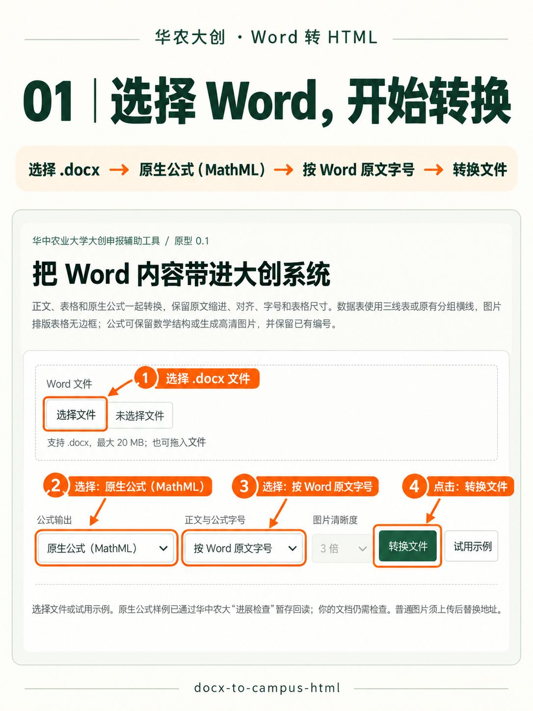
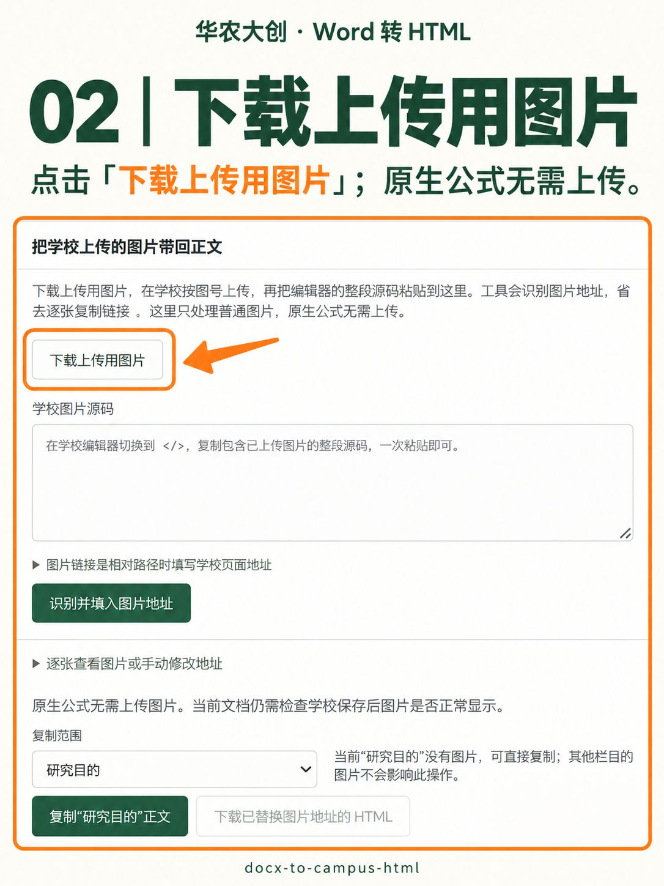
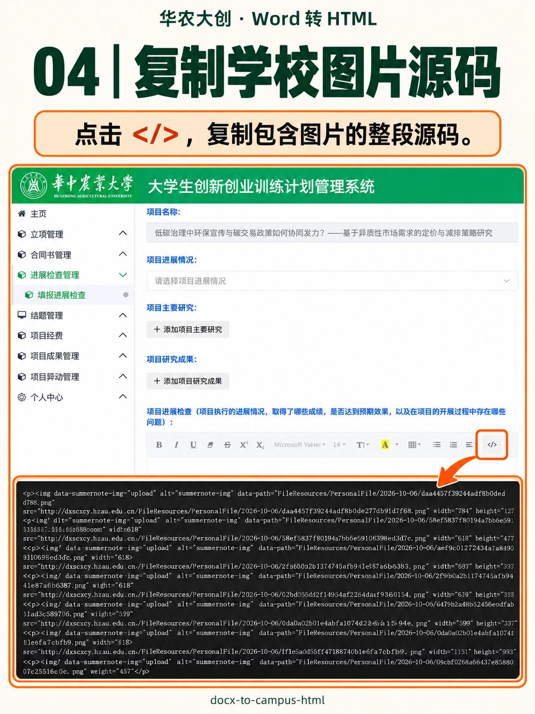
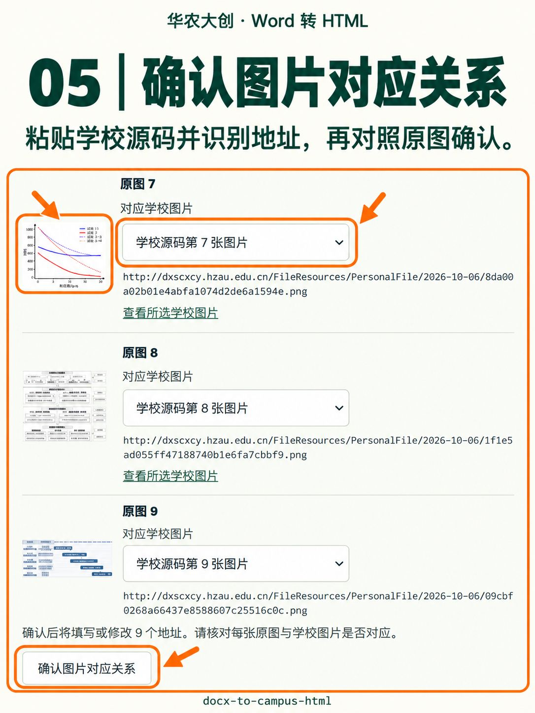
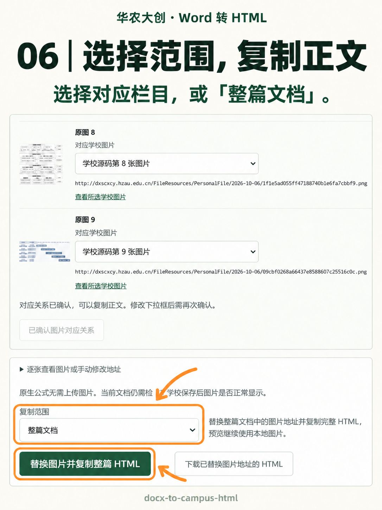
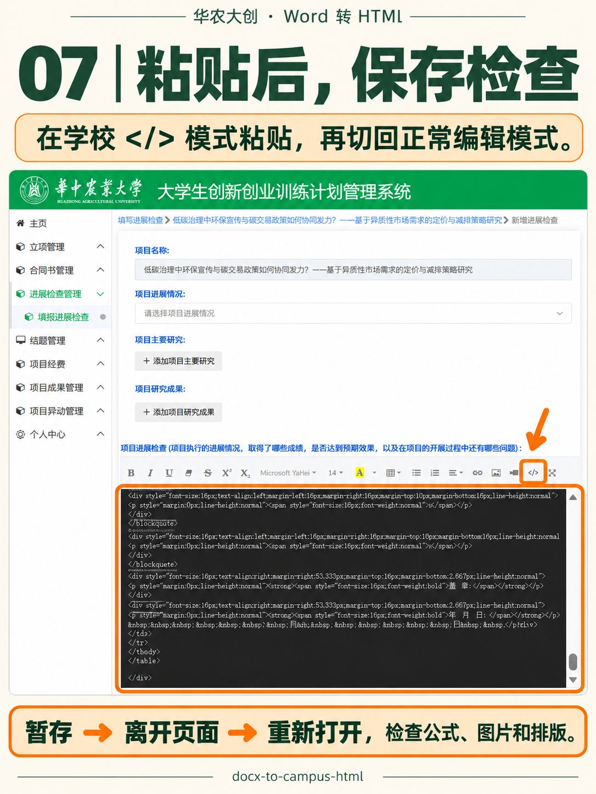

# 华中农业大学大创申报辅助工具（Word 转 HTML）

[](https://github.com/lyydw-0907/docx-to-campus-html/actions/workflows/test.yml)

本项目专用于华中农业大学大学生创新创业训练计划管理系统，将 Word 内容转换为该系统富文本编辑器可导入的 HTML。开发、兼容验证及发布验收均以本校大创系统为目标。

用户确认当前版本所需的学校端验证已全部完成，包括此前列出的最新排版、表格样式和图片导入保存回读。学校端验证不再作为本版本的发布待办。该结果来自用户实测确认，记录见 [验证记录](docs/verification.md)；工具不会自动把后续新转换文档标记为已验证。

学校申报页的蓝色栏目名称由系统提供。转换后可选择“研究目的”“国内外研究现状和发展动态”“研究内容”“创新点与项目特色”“技术路线、拟解决的问题”“项目研究进度安排”“已具备的条件，尚缺少的条件及解决方法”和“预期成果”，分别预览、复制对应正文。只移除对应的外层栏目标题，保留正文里的小标题、编号、缩进、字号、公式、图片及题注；Word 的“已有基础”对应学校的条件栏目。

自动拆分要求至少两个已确认栏目标题位于同一容器、同一标题层级。单单元格的 Word 正文包装表支持拆分，多列表格中的标题不会误当作申报栏目；重复标题、层级混用或多区域歧义时保留全文并提示，不猜正文归属。未知的同级内容（如“参考文献”）单独显示为待分配，保留标题与正文，也可单独复制；“待分配”只表示尚未确定学校粘贴位置。封面、基本信息、经费及签名等仍在整篇核对版中。

有分栏结果时，默认选第一个已确认栏目。可在“复制范围”选择栏目、待分配片段或“整篇文档”；整篇复制保留原封面、所有栏目和待分配内容。没有图片的内容可直接复制，参考文献等无图片段不受其他部分的图片地址或确认状态影响；含图片时需先完成现有图片地址映射，整篇使用全部图片地址。整篇和各片段分别缓存，修改图片地址会作废旧映射，等待复制期间切换范围会取消这次复制。下载包的 `sections/` 包含各片段 HTML、预览及索引，`fragment.html` 保留整篇。学校分栏目填写时，使用对应栏目的正文；待分配片段的粘贴位置由用户选择。

把 `.docx` 正文、表格和 Word 原生公式转换为富文本编辑器的 HTML 片段，保留原段落的首行缩进、悬挂缩进和对齐。浏览器界面默认使用原生 MathML 和 Word 原文字号，正文与公式采用各自在原文中的字号；也可统一为 14、16、18 或 20 px。MathML 保留数学结构，不生成公式图片；可切换到高清 PNG。两种公式格式都保留已有的简单公式编号，不自动编号。

原文字号会读取正文、标题、题注和公式的直接设置及样式继承；缺少字号时使用回退字号。居中的图片段落和题注保留各自对齐，选择统一字号仍保留原段落缩进、对齐。

列表用网页原生编号和一层缩进，清除列表正文叠加的首行、悬挂和左缩进，保留起始编号与编号类型。只有公式及空白、句末标点的段落按可用宽度居中，覆盖 Word 中用于手动摆放公式的固定缩进；保留原公式的数学显示模式、文字内容和标点。正文中的行内公式继续随正文排列。

表格恢复 Word 的首选宽度、列宽比例、居中/右对齐、单元格留白、段落行距及最小行高，不再一律撑满页面。自动宽表根据原列网格估算宽度，并设置最大宽度；实际高度可随内容增长。重复表头标志不使普通文字额外加粗，原文的加粗保留。条件表格样式、表格整体缩进及 Word 分页不作精确还原。

普通数据表使用三线表；源有明确横线且没有竖线的分组表保留原水平分隔，条件表格样式不据此推测。仅包含图片、图号题注和空白的图片排版表格清除所有边框。嵌套表格分别处理，图片尺寸、单元格合并及题注字号保留。

图片排版表格按原宽度整体居中，图片和题注分别在各自单元格中居中，清除该区域叠加的正文首行及左右缩进。图片宽高、比例、原文件、题注字号与竖向间距保留；普通数据表、混合正文和编号公式不套用此规则。居中依靠表格和段落，移除图片自身样式后仍有效。

独立公式中可确认的 `#(数字)` 标记会分离为右侧编号，支持公式末尾、外部文字及全角标签。带完整标记、独占段落的 Word 行内数学节点按独立公式渲染；正文中的行内公式不变。不完整或有歧义的标记保留原式；公式内未处理的 hash 会提示检查。原始 TeX 仍在清单和 MathML 注释中，`renderTex` 另记渲染正文。

MathML 已接入本地转换器、界面、API 和 CLI，包括运算符减号规范化、公式居中和原编号同一行靠右。API/CLI 未指定格式时仍默认 PNG；使用 MathML 需显式选择。每份新转换清单的 `verification` 仍为 `unverified`，表示工具未自动验证该输出在学校的保存回读结果；用户已完成的实测结果另记于验证记录。

未指定源水平规则的普通表格默认转换为三线表，无需设置：顶线、底线为 `1.5px solid #111`，表头下线为 `1px solid #111`，没有竖线或正文行间横线。显式 `thead` 使用整个表头组的末边界，否则使用首行；嵌套表格分别处理，合并单元格和内容保留。公式编号表格仍无边框，MathML 矩阵不受影响。

此前在华中农业大学“进展检查”中，经用户授权完成了独立合成草稿测试：原始复杂样例的 5 个数学减号被保存为问号，语义验证失败；规范化为 ASCII `-` 运算符后，10 个公式和 8 个右侧编号通过编辑页及详情页回读。草稿均已删除，未正式提交或覆盖已有材料。该证据不推广为任意转换文档兼容。见 [复杂公式验证](docs/mathml-advanced-verification.md)、[编辑器核查](docs/school-editor-report.md) 和 [网络核查](docs/access-report.md)。

ASCII `-` 与原数学减号的源字符、字形有差异，不能视为像素无损还原。MathML 模式中的普通图片仍须通过学校图片入口上传并映射真实地址；该流程已获用户保存回读确认。PNG 模式还须上传公式图片。学校前端会替换 data URI 图片并清除 img 内联样式，PNG 行内公式图片的基线对齐仍未解决。

## 快速开始

需要 Node.js 22 或更高版本。Windows x64、Linux x64 可自动配置 Pandoc；其他平台请自行安装 Pandoc 并设置 `PANDOC_PATH`。

```powershell
npm ci
npm run setup:pandoc
npm run demo
npm start
```

打开 <http://127.0.0.1:4317>，点击“试用示例”，或选择自己的 Word 文件。公式输出默认“原生公式（MathML）”，字号默认“按 Word 原文字号”；缺少原字号时回退为 14 px。PNG 和统一字号均可从相应菜单选择。示例含中文正文、标题、加粗、上下标、表格、普通图片、行内原生公式和带原编号的独立公式。申报书识别出栏目后，在“复制范围”选择目标栏目，复制正文到学校对应编辑框的源码模式，也可选择“整篇文档”复制完整 HTML；所选内容含图片时先完成图片地址映射。

Windows 完成上述依赖安装后，也可双击项目目录中的 `start-local.cmd`。它会检查工具是否已运行，必要时在后台启动服务；随后在浏览器打开或刷新上述地址即可。关闭启动窗口不会停止服务；重启电脑后需要再次双击启动。启动日志在 `output/server/`；若 4317 端口被其他程序占用，启动入口会提示冲突，不会停止其他程序。

本地转换记录失效或服务重启后，已打开的页面会在识别图片、下载或复制时，用原 Word 与原转换配置自动恢复并重试一次。恢复会核对正文、公式、图片清单及栏目归属，保留当前选择、粘贴的学校源码和已填图片地址；若核对不一致则停止操作并保留输入。原 Word 只保留在当前页面内存中，刷新或关闭页面后仍需重新选择文件。

图片在学校源码中的顺序与 Word 不同时，可在每张原图旁选择它对应的“学校源码第几张图片”，然后点击“确认图片对应关系”。选中已占用的图片序号会交换两张的对应关系；已手工填写的地址默认保留，选择另一张已上传图片并确认后才替换。选择缺失、地址重复或无效时不能确认。确认后仍可继续调整，新的调整须再次确认后才能复制或下载映射正文。这里只调整图片地址对应关系，Word 中图片的位置和公式内容保持不变。

文件入口使用可见原生“选择文件”按钮，也可将单个 `.docx` 拖入“Word 文件”框（最大 20 MB）。显示文件名后点击“转换文件”；选择或拖入不会自动转换。若内置浏览器未显示系统文件窗口，可在 Edge 或 Chrome 中打开同一本机地址。

`npm run demo` 调用 CLI 的默认 PNG 模式，生成 `output/demo.docx`、`output/demo/preview.html`、`output/demo/fragment.html`、`output/demo/assets/` 和 `output/demo/manifest.json`。它与浏览器“试用示例”的默认 MathML 模式不同。文件默认留在本机，不加入 Git。

自动安装器从 Pandoc 官方 GitHub release 下载固定 3.6.4 版本，仅放入 `tools/pandoc/`。若下载失败，可手动安装同一官方版本，然后设置：

```powershell
$env:PANDOC_PATH = 'C:\path\to\pandoc.exe'
```

安装器会记录下载文件的 SHA-256；如已有可信的校验值，可用 `PANDOC_ARCHIVE_SHA256` 强制校验。首次下载计算出的哈希本身不是独立真实性验证。

## 七步图文教程

完成上方本地安装并打开工具后，按以下步骤导入内容。以下为操作示意图，实际按钮和页面以当前版本为准。

### 1. 选择 Word，开始转换

选择 `.docx` 文件，公式输出选择“原生公式（MathML）”，字号选择“按 Word 原文字号”，然后点击“转换文件”。MathML 模式无需逐张上传公式截图。



### 2. 下载上传用图片

点击“下载上传用图片”，解压图片包。MathML 模式下只需上传普通图片；PNG 模式还需上传公式图片。所选栏目没有图片时，可跳过第 2—5 步。



### 3. 在学校系统上传图片

进入学校对应编辑框，点击工具栏的图片按钮，按下载文件的图号顺序上传。


### 4. 复制学校图片源码

上传后点击学校编辑器的 `</>` 源码按钮，一次复制包含已上传图片的整段 HTML，无需逐张抄写链接。



### 5. 确认图片对应关系

回到本工具，将源码粘贴到“学校图片源码”，点击“识别并填入图片地址”。对照原图核对图片序号，必要时调整下拉框，再点击“确认图片对应关系”。



### 6. 选择范围，复制正文

在“复制范围”选择学校对应栏目，复制该栏目的正文；需要完整内容时选择“整篇文档”，点击“替换图片并复制整篇 HTML”。学校分栏目填写时，请分别使用对应正文。



### 7. 粘贴后，保存检查

回到学校编辑器的 `</>` 源码模式粘贴生成的 HTML，再切回正常编辑模式。暂存后离开页面并重新打开，检查公式、编号、图片和排版。



## 命令行与 API

```powershell
node src/cli.mjs '你的文件.docx' --out output/my-document --formula-format mathml --font-mode word --font-size 14 --images embedded
```

CLI 和 `convertDocx` 的默认值仍是 `formulaFormat: 'png'`、`fontMode: 'uniform'`、16 px，以保持已有调用行为。`--font-mode word` 保留各段文字与公式的原字号，此时 `--font-size` 仅指定缺少原字号时的回退；`--font-mode uniform --font-size 14` 统一正文与公式字号，标题沿用按等级放大的字号。选择 PNG 可用 `--formula-format png --font-size 14 --scale 3`；`--scale` 只影响图片密度，不改变逻辑字号。MathML 不生成公式图片，清晰度倍数对它无效。CLI 还保留实验 SVG 选项，但学校上传和保存未验证；界面及 HTTP API 只提供 MathML/PNG。

库 API 可显式传入：

```javascript
import { readFile } from 'node:fs/promises';
import { convertDocx } from './src/convert.mjs';

const result = await convertDocx(await readFile('你的文件.docx'), {
  formulaFormat: 'mathml', fontMode: 'word', fontSize: 14, imageMode: 'embedded'
});
```

HTTP API 使用 `POST /api/convert?formulaFormat=mathml&fontMode=word&fontSize=14`，请求体为 DOCX 原始二进制。未指定 `fontMode` 时仍使用 `uniform`、未指定 `fontSize` 时为 16 px；未指定 `formulaFormat` 时仍为 PNG。字号模式只接受 `word` 或 `uniform`，并记录在转换清单中。无论选何种模式或格式，返回的 `manifest.verification` 都是 `unverified`。

转换结果额外返回 `sections`；每项包含稳定的 `id`、学校栏目 `title`、`kind`（`field` 或 `unassigned`）、`sourceHeading`、`fragment`、`preview`、`assetFilenames`、公式及图片数量。未能确定边界时为空数组并给出提示，原有全文字段保持。映射导出的 JSON 同样返回已替换图片地址的各片段。复制时可向 `POST /api/export/:jobId` 传入 `{mode:'mapped', format:'json', sectionId, urls}`，只返回 `{section}` 中所选正文的元数据和 HTML；已识别的 field/unassigned 片段均可复制，待分配片段保留原 kind 与标题。`sectionId:'whole'` 返回原始整篇正文，有分栏时也支持。复制单个片段时不读取全文或其他片段；所有范围均不处理预览，映射 API 仍验证完整图片地址。不传 `sectionId` 的完整 JSON 和 ZIP 保持原行为。

图片模式独立于公式格式：

- `embedded`：图片写成 data URI，用于独立预览。已确认华中农业大学当前进展检查页面会将这种图片替换为破图，不能直接粘贴到该编辑器。
- `files`：引用 `assets/`，用于本地预览。复制到学校编辑器不会上传这些文件。
- `mapped`：使用学校插图工具生成的绝对 HTTP(S) 图片地址；每张图片都必须提供映射。

浏览器界面现在提供简化流程，无需逐张抄写图片地址：

1. 转换后点击“下载上传用图片”，得到只有图片和顺序说明的小包；文件名前有图号。
2. 在学校编辑器按图号上传图片，再从 `</>` 源码模式一次复制包含图片的整段 HTML。
3. 粘贴到“学校图片源码”，点击“识别并填入图片地址”。保留文件名时自动匹配；学校改名时，对照原图并在下拉框选择对应的学校图片序号，然后确认。需要时可点击“查看所选学校图片”核对。相对链接需要提供学校页面地址。
4. 在上方或图片确认下方选择复制范围：可复制对应栏目，或选择“整篇文档”一次复制全部 HTML。没有图片的栏目可直接复制，不受其他栏目图片影响；含图片的范围首次复制仅处理所选正文，之后复用缓存。整篇含图片时需完整映射；也可下载包含全部栏目的映射 HTML。手工修改仍保留在展开列表中，已有不同地址不会无声覆盖。

识别只解析本机粘贴的源码，不渲染它、不请求图片 URL，也不在学校执行上传或保存。图片缺失、重复、冲突或数量不同不会自动按顺序填。确认复用现有图片控件；更改对应关系或手工地址会使映射缓存失效。映射后的源码使用学校地址，界面预览始终使用原本地图片，不自动请求学校图片；“查看所选学校图片”仍由用户主动打开。当前文档仍须检查学校保存后的效果。

CLI 仍可先用 `embedded` 或 `files` 导出资产，上传后准备图片地址 JSON。MathML 模式只需映射普通图片；PNG 模式还包括公式图片：

```json
{
  "formula-实际生成的文件名.png": "https://学校图片服务器/uploads/实际地址.png",
  "image-实际生成的文件名.png": "https://学校图片服务器/uploads/实际地址.png"
}
```

```powershell
node src/cli.mjs '你的文件.docx' --out output/mapped --formula-format mathml --font-mode word --font-size 14 --images mapped --asset-urls '图片地址.json'
```

示例 JSON 只是格式说明；请使用资产清单中的真实文件名和学校实际生成的地址。不要把包含登录信息、临时 token 或私人材料的文件加入仓库。

## 学校端验证

界面提供“生成测试片段”，覆盖标题、正文、加粗、上下标、表格、合并单元格、字号、行距、图片尺寸、基线、PNG data URI、SVG data URI 和 MathML。其中 data URI 是诊断项；已知此学校进展检查页面会拒绝它，不应把诊断片段当作可直接使用的材料。

2026-10-04 的独立草稿实验使用不含图片的 MathML 合成样例，已完成暂存、编辑页回读、详情页显示和删除清理。复杂公式的原始轮与兼容轮各执行一次新增暂存和一次删除，合计 4 次业务写入、24 次通知模块 POST 拦截；此前两个简单公式的实验单独记录。2026-10-06，用户确认了当前版本最新排版与普通图片导入的保存回读结果。以下步骤用于核查后续新文档或未覆盖的输出模式。

1. 使用可删除的测试草稿，保留原稿；不要覆盖正式申报材料。
2. 切换学校编辑器的 HTML 源码模式，粘贴测试片段。
3. 保存草稿，离开页面，重新打开，再复制源码。
4. 将保存前和回读后源码放入本地对比工具，检查标签、样式、图片地址，以及 MathML 结构、属性、显示字符码点和原始 TeX 注释的变化。
5. 在学校回读页面检查图片确实加载、公式字号和基线正确、独立公式编号位置正确。

源码对比不能替代图片加载和视觉检查，数学节点数量相同也不能证明字符和公式语义正确。所测 MathML 的保存回读证据不能替代 PNG 上传、其他公式或其他页面的验证。

为了继续适配，最少提供同一匿名测试草稿的**保存前 HTML、重新打开后的 HTML**，以及字段名称和图片是否显示即可。无需提供账号、密码、Cookie 或 token。

## 实现与边界

转换先用 Pandoc 读取 Word 原生 OMML 和正文结构。MathML 模式批量转换数学节点，经过数学标签/属性允许列表清理与运算符减号规范化，再写回正文；保留原始 TeX 注释，并记录兼容变更。对准确匹配的源 OMML 运算符恢复其明确上下限位置，PNG 模式也保留该设置。PNG 使用 MathJax 生成自包含 SVG，再由 sharp 生成高清 PNG，保留逻辑宽高和基线深度。见 [公式方案和来源](docs/formula-design.md)。

支持标题、段落、原文缩进与对齐、可选原字号、加粗、上下标、默认三线样式的普通表格、嵌入式 PNG/JPEG/GIF/WebP，以及所选引擎和允许列表能处理的原生公式。独立公式的简单原编号保留，包括单行方程数组末尾完整的 `#(数字)` 标记；使用无边框、0 padding、固定布局的 10% / 80% / 10% 三列表格，公式居中、编号同一行靠右。多行、多列及不明确的标记不擅自分离。源确认的单行数组中，句号后孤立的 `#` 排版残留默认清理并记录，可通过库选项关闭；不新增编号。字号模式可选择原文或统一字号，文档页边距和分页不作还原。

原型不保证文本框、浮动图形、分页、复杂表格、页眉页脚和 MathType/OLE 公式的还原。EMF/WMF 等图片及系统字体依赖的公式字符会明确失败。若公式数量不一致或 Pandoc 报数学转换异常，会停止导出，避免悄悄漏公式。已确认学校当前进展检查页面拒绝 data URI 并清除 img 样式，图片上的基线对齐样式会丢失。当前版本学校端发布验收已由用户全部完成；该结果对应本次所测材料和使用流程，不代表任意新文档的逐项检查结果。

服务仅监听 `127.0.0.1`，文档不上传到外部服务，不存储学校登录信息，不访问外链图片，不调用申报保存或提交接口。转换结果在内存中最多保留 3 份，30 分钟后不能再下载。输入限制为 20 MB，并限制解压大小、公式数、图片数及转换时间。

## 开发与开源

```powershell
npm test
pwsh -NoProfile -File tools/network-check.ps1
```

截至 2026-10-06，本机 285 项测试全部通过，0 失败、0 跳过，覆盖整篇、分栏目和待分配片段复制、源样式加粗及取消加粗、栏目拆分与复制状态、公式、图片地址映射与顺序调整、过期结果恢复、原文字号与缩进、表格尺寸与分组横线、图片/题注居中及本地 HTTP 导出。实际文档在本地保留 189 个公式、9 个编号和 9 张原图；297个唯一匹配段落的字重已与原 Word 逐字核对，原标题和源字符样式加粗具有明确覆盖。Edge 已检查参考文献独立复制、整篇复制及图片确认、剪贴板回退、图片尺寸、题注格式和不同预览宽度下的居中，下载 ZIP 通过 CRC 与源码/图片字节核对。分栏不会改变原有全文输出；当前版本最新排版和普通图片导入的学校保存回读已由用户实测确认。本地验收、此前合成样例及用户确认记录见 [验证记录](docs/verification.md)，后续新转换文档仍需在本校系统检查。

集成测试需要可用 Pandoc；未配置时会明确跳过相关检查。GitHub Actions 在每次推送和拉取请求后，于 Ubuntu、Node.js 22 下安装引擎、运行测试和生成示例，结果见 [Actions](https://github.com/lyydw-0907/docx-to-campus-html/actions)。本版本面向华中农业大学大创系统公开测试，所测文档之外的复杂布局仍需核查。网络脚本只读取指定公开入口，不登录或保存申报。

项目代码采用 [MIT License](LICENSE)。Pandoc 是独立下载的 GPL-2.0-or-later 可执行程序，未加入本仓库；MathJax 等第三方依赖沿用各自许可证，见 [第三方说明](THIRD_PARTY_NOTICES.md)。

## 当前交付状态

- 本地源代码、MathML/PNG 示例转换、普通表格默认三线样式、普通图片地址映射与学校源码对比工具；对比工具逐项检查数学结构、属性、显示字符及 TeX 注释。
- 实际公网入口访问报告，以及进展检查编辑器的配置核查、MathML 临时测试和独立草稿暂存回读报告。
- 本地产品已接入 MathML、运算符减号规范化及原编号布局。此前 10 个合成样例的学校兼容版回读证据及原始失败证据保留，草稿均已删除；当前版本的最新排版和普通图片导入已获用户保存回读确认。
- 本机 MathML 产品示例包为 `output/campus-mathml-demo.zip`，含原生 Word、转换 HTML、预览和清单；当前版本的学校端发布验证已由用户全部完成，PNG 行内公式图片仍受学校清除基线样式的实现限制。
- [GitHub 源码仓库](https://github.com/lyydw-0907/docx-to-campus-html)；版本及源码包见 [Releases](https://github.com/lyydw-0907/docx-to-campus-html/releases)。
